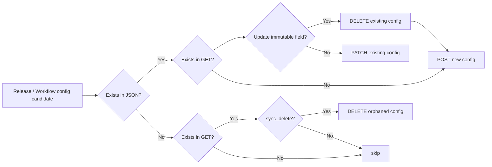

# apply-dataform-workflows

**Language: [English](README.md) | 日本語**

**JSON ファイルで定義した Dataform のワークフロー設定（リリース構成・ワークフロー構成）を、クラウド版の Dataform に冪等に反映する GitHub Action です。**

## クイックスタート

### 1. JSON ファイルを作成

`release_workflow_config.json`

```json:
{
  "$schema": "https://raw.githubusercontent.com/snhryt-neo/apply-dataform-workflows/v1/schema.json",
  "repository": "my-dataform-repo",
  "release_configs": [
    {
      "id": "production",
      "git_ref": "main",
      "schedule": "0 0 * * *",
      "timezone": "Asia/Tokyo"
    }
  ],
  "workflow_configs": [
    {
      "id": "daily-all",
      "release_config": "production",
      "schedule": "0 3 * * *",
      "timezone": "Asia/Tokyo",
      "targets": {
        "tags": ["daily"]
      }
    }
  ]
}
```

👉 テーブル単位での実行指定、実行オプションの切り替え、転送設定の停止など、より発展的な例は [こちら](examples/release_workflow_config_advanced.json) をご参照ください。

### 2. GitHub Actions のワークフローを設定

> [!IMPORTANT]
> このアクションには Google Cloud の認証は含まれません。事前に [`google-github-actions/auth`](https://github.com/google-github-actions/auth) で認証を済ませてください。
>
> また、事前に Workload Identity Provider と、それに紐づけて impersonate する Google Cloud のサービスアカウントを作成・設定しておいてください。標準的には、そのサービスアカウントに `Dataform 管理者` (`roles/dataform.admin`) 相当の IAM 権限が必要です（[厳格な act-as モード](https://docs.cloud.google.com/dataform/docs/strict-act-as-mode) が有効な場合、実行用サービスアカウントに対する `サービスアカウント ユーザー` (`roles/iam.serviceAccountUser`) 権限も必要）。

```yaml
- name: Apply Dataform release / workflow configurations
  uses: snhryt-neo/apply-dataform-workflows@v1
```

👉 完全なワークフローの例は [こちら](examples/.github/workflows/apply-dataform-workflows.yml) をご参照ください。

### 3. Google Cloud 側で変更が反映されていることを確認

以上！

---

## モチベーション

[クラウド版の Dataform](https://cloud.google.com/dataform?hl=ja) （= Google Cloud のマネージドサービスとしての Dataform ） の「リリース構成」と「ワークフロー構成」は [Dataform CLI](https://github.com/dataform-co/dataform) で管理ができず、マネージドコンソールの画面からポチポチ駆動開発をするか、 [Terraform](https://registry.terraform.io/providers/hashicorp/google-beta/latest/docs/resources/dataform_repository_workflow_config) で管理するのが主流です。

前者に関しては、変更履歴やレビュープロセスがなかったり、そもそも手作業が手間だったりという問題があります。一方の Terraform は一貫してコードベースで管理ができて便利な反面、 Dataform だけを管理したい場合には too much になりがちです。また Dataform のメンテナー（アナリティクスエンジニア等）と Google Cloud 全体のインフラ担当（ SRE 等）が別れているために、Dataform のワークフローの実行時間を 1 時間ずらしたいだけにも関わらず、インフラチームによる重厚な Terraform のレビュー・デプロイのプロセスを経ないと、ワークフローの変更ができない、といった状況もしばしば見受けられます。

これらの課題を解決すべく、このアクションでは Dataform のメンテナーが手軽に、冪等に、SQLX コードに近い場所で、 Dataform のワークフローをコードベースで管理する体験を提供します。

*あの頃の [enivironments.json](https://youtu.be/KdxKP_eo8bc?si=XZ1x3z_1OKGBoNYX) を取り戻そう！*

👉 より詳細については、私が記載した [Zenn 記事](https://zenn.dev/snhryt/articles/apply-dataform-workflows) をご参照ください。

## 仕組み

本ツールは、簡単に言うと「[Dataform REST API](https://docs.cloud.google.com/dataform/reference/rest) の Wrapper」です。裏では、 JSON の内容を読み取り、それを使っていい感じに API を叩く処理をしています。処理フロー全体としては、リリース構成の作成・更新 -> （ `compile` が true の場合）リリース構成のコンパイル -> ワークフロー構成の作成・更新という流れで処理が進みます。

### リリース/ワークフロー構成の更新フロー



設定が immutable になっており、API 経由で更新ができない一部の内容（リリース構成における `git_ref` や `compile_override`、ワークフロー構成における `options` ）については、変更時に `PATCH` ではなく `DELETE -> POST` を実行します。

> [!NOTE]
> JSON ファイルを Single Source of Truth として運用する思想のため、 `sync_delete` オプションはデフォルトで有効化されています。このオプションが有効化されている場合、クラウド上に存在するが JSON に含まれないリリース構成およびワークフロー構成は**自動的に削除されます。**
>
> この挙動を避けたい場合には `sync_delete: false` を指定してください。ただし、この場合は JSON ファイルとクラウド側で完全な同期が取れなくなる点にご注意ください。

### リリース構成のコンパイルについて

`compile: true` を指定すると、構成更新ステップの後で各リリース構成をコンパイルし、最新の `releaseCompilationResult` で release config を更新します。

これは push 後にコード変更をすぐ反映したい場合に有効です。

`compile: false` で、リリース構成のコンパイルをスケジューラベースにすると、次のようなリスクが考えられます。

- ワークフローがエラーで動かない: たとえば、ワークフロー側で新規作成したタグ・アクション・テーブルを参照していても、それらが現在の `releaseCompilationResult` にまだ含まれていない場合があります
- ワークフローが意図しないコードで実行される: 最新のリポジトリ状態や意図したデプロイ内容と一致しない、古い compilation result を使って実行される可能性があります

Dataform に連携される情報を常に最新にしておくために、`compile: true` としておくことを推奨します。

## Inputs

| 名前 | デフォルト | 説明 |
| :--- | :--- | :--- |
| `dry_run` | `false` | 変更を適用せずプレビューのみ |
| `compile` | `false` | リリース構成ごとにコンパイル & 結果更新を行う |
| `sync_delete` | `true` | JSON にないリリース構成・ワークフロー構成を Google Cloud から削除する |
| `config_file` | `release_workflow_config.json` | 本アクション設定用の JSON ファイルパス |
| `workflow_settings_file` | `workflow_settings.yaml` | Dataform の設定ファイルパス |
| `project_id` | `workflow_settings.yaml` の `defaultProject` | Google Cloud プロジェクト ID |
| `location` | `workflow_settings.yaml` の `defaultLocation` | Google Cloud リージョン |
> [!NOTE]
> `workflow_settings.yaml` または `location` 入力で `US` / `EU` のようなマルチリージョンを指定した場合、Dataform Cloud は単一リージョンのみ対応のため自動で正規化されます。`US` は `us-central1`、`EU` は `europe-west1` に変換されます。変換が発生した場合は GitHub Actions の warning annotation を出力します。

## Outputs

| 名前 | 説明 |
|------|------|
| `release_configs_created` | 新規作成した release config ID（カンマ区切り） |
| `release_configs_updated` | 更新した release config ID（カンマ区切り） |
| `release_configs_deleted` | 削除した release config ID（カンマ区切り） |
| `workflow_configs_created` | 新規作成した workflow config ID（カンマ区切り） |
| `workflow_configs_updated` | 更新した workflow config ID（カンマ区切り） |
| `workflow_configs_deleted` | 削除した workflow config ID（カンマ区切り） |

## JSON リファレンス

`"$schema": "https://raw.githubusercontent.com/snhryt-neo/apply-dataform-workflows/v1/schema.json"` を設定ファイルに追加すると、エディタで補完が効きます。完全なスキーマは [`schema.json`](./schema.json) を参照してください。

### トップレベルフィールド

| フィールド | 必須 | 説明 |
|-----------|:----:|------|
| `$schema` | | エディタ補完用の JSON Schema URL |
| `repository` | ✅ | Dataform リポジトリ名 |
| `release_configs` | ✅ | リリース構成オブジェクトの配列 |
| `workflow_configs` | | ワークフロー構成オブジェクトの配列 |

<details>

<summary><code>release_configs[*]</code> のフィールド</summary>

| フィールド | 必須 | 型 | 説明 |
|-----------|:----:|----|------|
| `id` | ✅ | `string` | 一意な識別子（`[a-z][a-z0-9_-]*`） |
| `git_ref` | ✅ | `string` | ブランチ名・タグ・コミット SHA のいずれかを文字列で指定 |
| `disabled` | | `boolean` | `true` のとき構成を一時停止します。省略時は `false` になります。 |
| `schedule` | | `string` | 自動コンパイルの cron 式。省略時はオンデマンド |
| `timezone` | | `string` | IANA タイムゾーン |
| `compile_override` | | `object` | コンパイル時のオーバーライド設定 |

</details>

<details>

<summary><code>workflow_configs[*]</code> のフィールド</summary>

| フィールド | 必須 | 型 | 説明 |
|-----------|:----:|----|------|
| `id` | ✅ | `string` | 一意な識別子 |
| `release_config` | ✅ | `string` | 参照する release config の `id` |
| `targets` | ✅ | `object` | `{ "tags": [...] }` / `{ "actions": [...] }` / `{ "is_all": true }` のいずれか |
| `disabled` | | `boolean` | `true` のとき構成を一時停止します。省略時は `false` になります。 |
| `schedule` | | `string` | 実行スケジュールの cron 式。省略時はオンデマンド |
| `timezone` | | `string` | IANA タイムゾーン |
| `options` | | `object` | `invocationConfig` にマージされる実行オプション |

</details>

<details>

<summary><code>targets</code> のフィールド</summary>

いずれか 1 種類のみ指定可能。複数設定されている場合は `is_all` > `tags` > `actions` の優先順位で採用される。

| フィールド | 型 | 説明 |
|-----------|-----|------|
| `tags` | `string[]` | タグでアクションを選択 |
| `actions` | `string[]` | 実行するアクション名、または `name` に加えて任意で `database` / `schema` を持つオブジェクトを指定。省略または `null` の場合は `workflow_settings.yaml` の `defaultProject` / `defaultDataset` を使います |
| `is_all` | `boolean` | true の場合はすべてのアクションを実行 |


</details>

<details>

<summary><code>options</code> のフィールド</summary>

| フィールド | 型 | 説明 |
|-----------|-----|------|
| `include_dependencies` | `boolean` | 依存元（アップストリーム）のテーブルも更新する（マネージドコンソール上の「依存関係を含める」） |
| `include_dependents` | `boolean` | 依存先（ダウンストリーム）のテーブルも更新する（マネージドコンソール上の「依存者を含める」） |
| `full_refresh` | `boolean` | incremental テーブルをフルリフレッシュ（マネージドコンソール上の「完全に更新して実行する」） |
| `service_account` | `string` | リポジトリに設定されたデフォルトのサービスアカウント以外を使う場合の設定 |

</details>

## コントリビューター向け: 開発手順

### Prerequisites

- uv
- pre-commit
- gcloud CLI (w/ ADC 認証) ※ 実際の Google Cloud 環境を使ってテストをする場合

### Setup

```bash
uv sync --all-groups
pre-commit install
```

### Run (Local)

ドライラン（実際の API 呼び出しなし）:

```bash
CONFIG_FILE=examples/release_workflow_config_simple.json \
WORKFLOW_SETTINGS=examples/workflow_settings.yaml \
DO_COMPILE=false \
DRY_RUN=true \
uv run python -m apply_dataform_workflows.deploy
```


Google Cloud 環境への apply （実際の API 呼び出しあり）:

`tests/release_workflow_config.json` と `tests/workflow_settings.yaml`（どちらも `.gitignore` 済み）に実際の値を設定した上で


```bash
CONFIG_FILE=tests/release_workflow_config.json \
WORKFLOW_SETTINGS=tests/workflow_settings.yaml \
DO_COMPILE=false \
uv run python -m apply_dataform_workflows.deploy
```

> [!NOTE]
> 実際の Google Cloud 環境を使ってテストをする場合は `DO_COMPILE=false` を忘れずに。`true` にすると、Dataform の GitHub リポジトリではなく、このリポジトリの commit SHA でコンパイルが走ってしまい、ワークフローが動作しなくなります。

### Test

```bash
uv run pytest
```

[GitHub Actions の CI](/.github/workflows/ci.yml) 上で自動実行されます。

### Lint / Format

```bash
uv run ruff check .
uv run ruff format .
```

pre-commit フックが設定されており、`git commit` 時にステージ済みファイルへ自動的に ruff が実行されます。

### ブランチ戦略

以下に従います。

- GitHub Flow
- Conventional Commits

## ライセンス

MIT License
