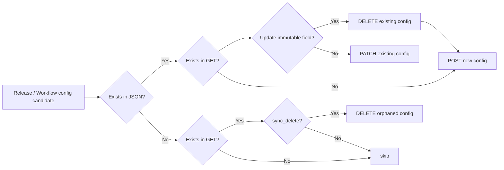

# apply-dataform-workflows

**Language: English | [日本語](README-ja.md)**

**A GitHub Composite Action that applies Dataform release configurations and workflow configurations from a single JSON file (SSoT).**

## Motivation

Release configurations (including compilation) and workflow configurations for managed Dataform cannot be managed through the [Dataform CLI](https://github.com/dataform-co/dataform). The mainstream approaches are either configuring them manually through the Google Cloud Console, or managing them with [Terraform](https://registry.terraform.io/providers/hashicorp/google-beta/latest/docs/resources/dataform_repository_workflow_config).

The Console-driven approach lacks change history and review processes, and manual configuration is tedious. On the other hand, while Terraform provides consistent code-based management, it can be overkill when you only need to manage Dataform. Furthermore, when Dataform maintainers (analytics engineers, etc.) and Google Cloud infrastructure owners (SRE, etc.) are separate teams, even a simple change like shifting a workflow schedule by one hour can require going through the infrastructure team's heavyweight Terraform review and deploy process.

To solve these issues, this action provides Dataform maintainers with a lightweight, idempotent, code-based workflow management experience — right next to their SQLX code.

*Let's bring back the [environments.json](https://youtu.be/KdxKP_eo8bc?si=XZ1x3z_1OKGBoNYX) days!*

## Quick start

### 1. Create your config file

`release_workflow_config.json`

```json
{
  "$schema": "https://raw.githubusercontent.com/snhryt-neo/apply-dataform-workflows/v1/schema.json",
  "repository": "my-dataform-repo",
  "release_configs": [
    {
      "id": "production",
      "git_ref": "main",
      "schedule": "0 0 * * *",
      "timezone": "Asia/Tokyo"
    }
  ],
  "workflow_configs": [
    {
      "id": "daily-all",
      "release_config": "production",
      "schedule": "0 3 * * *",
      "timezone": "Asia/Tokyo",
      "targets": {
        "tags": ["daily"]
      }
    }
  ]
}
```

👉 See [`examples/release_workflow_config_advanced.json`](examples/release_workflow_config_advanced.json) for a multi-environment setup with `compile_override` overrides and tag-based workflows.

### 2. Set up your workflow

> [!IMPORTANT]
> This action does not handle Google Cloud authentication. Use [`google-github-actions/auth`](https://github.com/google-github-actions/auth) beforehand.

```yaml
- name: Apply Dataform release / workflow configurations
  uses: snhryt-neo/apply-dataform-workflows@v1
```

👉 See [`examples/.github/workflows/apply-dataform-workflows.yml`](examples/.github/workflows/apply-dataform-workflows.yml) for a full workflow example.

### 3. Confirm changes are reflected in Google Cloud

That's it!

## Release / Workflow Configurations Update Flow



Release configs are deployed before workflow configs, so references within the same JSON file are resolved safely.

For existing release configs, a change in `gitCommitish` or `codeCompilationConfig` is handled with `DELETE -> POST`. For existing workflow configs, a change in `invocationConfig` is handled the same way. Other updates continue to use `PATCH`.

> [!NOTE]
> In line with the design principle of treating the JSON file as the Single Source of Truth (SSoT), `sync_delete` is enabled by default. When enabled, release configurations and workflow configurations that exist on Google Cloud but are not in the JSON file are **automatically deleted**.
>
> Set `sync_delete: false` to disable this behavior and only upsert. Note that in this case the JSON file and Google Cloud will no longer be in full sync.

## Release Compilation

When `compile: true` is set, the action compiles each release config after the release/workflow configuration update step and then patches the release config with the latest `releaseCompilationResult`.

This is useful when you want code changes to be reflected immediately on push.

When `compile: false` is used and release config compilation is left to a scheduler-based process, the following risks should be considered.

- workflows can fail to run due to errors: for example, a workflow may reference newly added tags, actions, or tables that are not yet included in the current `releaseCompilationResult`
- workflows can run against unintended code: execution may still use an older compilation result that does not match the latest repository state or the intended deployment

To keep the information linked to Dataform up to date, `compile: true` is recommended.

## Inputs

| Name | Default | Description |
|------|---------|-------------|
| `dry_run` | `false` | Preview changes without applying |
| `compile` | `false` | Compile each release config and update releaseCompilationResult |
| `sync_delete` | `true` | Delete release/workflow configs from Google Cloud that are not in the config file |
| `config_file` | `release_workflow_config.json` | Path to JSON SSoT file |
| `workflow_settings_file` | `workflow_settings.yaml` | Path to Dataform `workflow_settings.yaml` |
| `project_id` | from `workflow_settings.yaml` | Google Cloud project ID |
| `location` | from `workflow_settings.yaml` | Google Cloud region |
> [!NOTE]
> Multi-region locations from `workflow_settings.yaml` or the `location` input are normalized automatically because Dataform Cloud only supports single-region locations. `US` maps to `us-central1` and `EU` maps to `europe-west1`. When conversion occurs, the action emits a GitHub Actions warning annotation.

## Outputs

| Name | Description |
|------|-------------|
| `release_configs_created` | Comma-separated list of created release config IDs |
| `release_configs_updated` | Comma-separated list of updated release config IDs |
| `release_configs_deleted` | Comma-separated list of deleted release config IDs |
| `workflow_configs_created` | Comma-separated list of created workflow config IDs |
| `workflow_configs_updated` | Comma-separated list of updated workflow config IDs |
| `workflow_configs_deleted` | Comma-separated list of deleted workflow config IDs |

## JSON reference

Add `"$schema": "https://raw.githubusercontent.com/snhryt-neo/apply-dataform-workflows/v1/schema.json"` to your config file for editor autocompletion. See [`schema.json`](./schema.json) for the full schema.

### Top-level fields

| Field | Required | Description |
|-------|:--------:|-------------|
| `$schema` | | URL to JSON Schema for editor autocompletion |
| `repository` | ✅ | Dataform repository name |
| `release_configs` | ✅ | Array of release configuration objects |
| `workflow_configs` | | Array of workflow configuration objects |

<details>

<summary><code>release_configs[*]</code> fields</summary>

| Field | Required | Type | Description |
|-------|:--------:|------|-------------|
| `id` | ✅ | `string` | Unique identifier (`[a-z][a-z0-9_-]*`) |
| `git_ref` | ✅ | `string` | Branch name, tag, or commit SHA (plain string passed directly as `gitCommitish`) |
| `disabled` | | `boolean` | When true, pauses the config. Defaults to `false` when omitted. |
| `schedule` | | `string` | Cron expression for auto-compilation; omit for on-demand |
| `timezone` | | `string` | IANA time zone |
| `compile_override` | | `object` | Compilation override settings |

</details>

<details>

<summary><code>workflow_configs[*]</code> fields</summary>

| Field | Required | Type | Description |
|-------|:--------:|------|-------------|
| `id` | ✅ | `string` | Unique identifier |
| `release_config` | ✅ | `string` | ID of the release config to reference |
| `targets` | ✅ | `object` | One of `{ "tags": [...] }`, `{ "actions": [...] }`, or `{ "is_all": true }` |
| `disabled` | | `boolean` | When true, pauses the config. Defaults to `false` when omitted. |
| `schedule` | | `string` | Cron expression for execution schedule; omit for on-demand |
| `timezone` | | `string` | IANA time zone |
| `options` | | `object` | Execution options merged into `invocationConfig` |

</details>

<details>

<summary><code>targets</code> fields</summary>

Only one of the three forms can be specified. If multiple are present, the priority is `is_all` > `tags` > `actions`.

| Field | Type | Description |
|-------|------|-------------|
| `tags` | `string[]` | Select actions by tag |
| `actions` | `string[]` | Select specific action names, or objects with `name` plus optional `database` / `schema`; omitted or `null` values fall back to `workflow_settings.yaml` `defaultProject` / `defaultDataset` |
| `is_all` | `boolean` | Run all actions when `true` |

</details>

<details>

<summary><code>options</code> fields</summary>

| Field | Type | Description |
|-------|------|-------------|
| `include_dependencies` | `boolean` | Include transitive dependencies |
| `include_dependents` | `boolean` | Include transitive dependents |
| `full_refresh` | `boolean` | Full refresh incremental tables |
| `service_account` | `string` | Custom service account for execution |

</details>

## Contributor Guide

### Prerequisites

- uv
- pre-commit
- gcloud CLI (with ADC auth) — only required when testing against a real Google Cloud environment

### Setup

```bash
uv sync --all-groups
pre-commit install
```

### Run (Local)

Dry-run (no actual API calls):

```bash
CONFIG_FILE=examples/release_workflow_config_simple.json \
WORKFLOW_SETTINGS=examples/workflow_settings.yaml \
DO_COMPILE=false \
DRY_RUN=true \
uv run python -m apply_dataform_workflows.deploy
```

To apply against a real Google Cloud environment, put actual values in `tests/release_workflow_config.json` and `tests/workflow_settings.yaml` (both are git ignored):

```bash
CONFIG_FILE=tests/release_workflow_config.json \
WORKFLOW_SETTINGS=tests/workflow_settings.yaml \
DO_COMPILE=false \
uv run python -m apply_dataform_workflows.deploy
```

> [!NOTE]
> Do not forget `DO_COMPILE=false` when testing against a real Google Cloud environment. If set to `true`, compilation will run against this repository's codebase instead of your Dataform repository, causing your workflows to break.

### Test

```bash
uv run pytest
```

Runs automatically in GitHub Actions CI.

### Lint / Format

```bash
uv run ruff check .
uv run ruff format .
```

The pre-commit hook runs ruff automatically on staged files.

### Branch Strategy

- GitHub Flow: branch from `main`, open a PR, merge back to `main`. `main` is always deployable. Never push directly to `main`.
- Branch naming: `type/short-description` (for example, `feat/add-dry-run`, `fix/upsert-error`, `docs/improve-readme`)
- Commit messages and PR titles must follow Conventional Commits: `type: description` or `type(scope): description`

## License

MIT License
